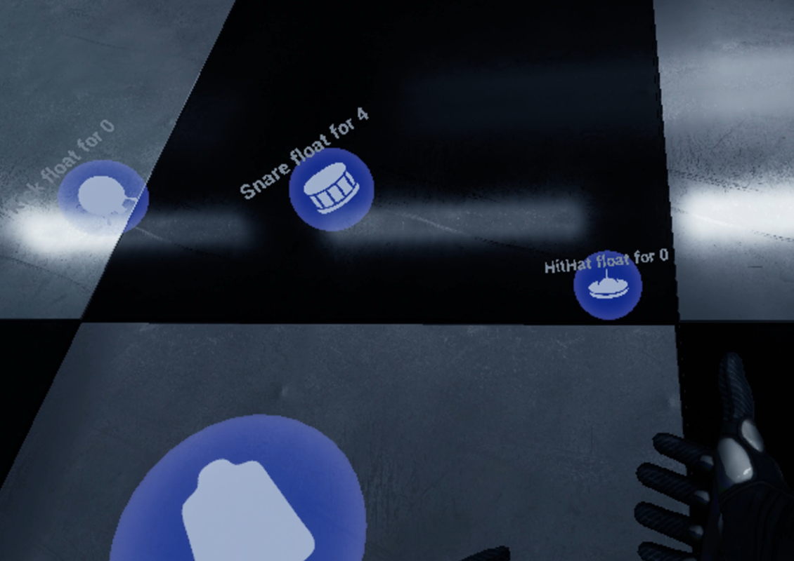

# SymphonySphere

SymphonySphere is an immersive VR playground built with Unreal Engine 5, in which players manipulate “Instrumental Spheres” to convert physics-driven interactions into musical output. It blends interactive physics simulation, spatial audio, and VR input to allow for creative expression.

## Features

- Real‐time physics‐based interaction: Instrumental Spheres respond to collisions, motion, and environmental forces.  
- Procedural audio generation: Physical events (e.g. sphere collisions, velocity) are mapped to sound parameters.  
- VR support: Interfaces and controls built for immersive virtual reality platforms.  
- Modular instrument components: Different spheres/instruments with distinct audio‐profiles or materials.  
- Visual feedback: Dynamic visuals respond to physics events (e.g. particle effects, motion trails).  
- Spatial audio / sound positioning: Audio sources are located in 3D space to enhance immersion.

## Tech Stack

| Component | Purpose |
|----------|---------|
| **Unreal Engine 5** | Core engine for rendering, physics, VR integration, and project orchestration. |
| **C++ + Blueprints** | Logic implementation: physics behavior, audio mapping, interaction handlers. |
| **VR SDK** (e.g. OpenXR) | Handling headset and controller input, tracking, and rendering for VR. |
| **Audio engine** (UE5 built‐in / third‐party plugins) | Producing, mixing, and spatializing sounds. |
| **Physics engine** (UE5 Chaos) | Simulating rigid bodies, collisions, forces. |
| **3D assets / models** | Visual geometry for spheres and environment. |

## Technical Details

| Module / File | Algorithm / Technique Used | Inputs / Outputs / Behavior |
|---------------|-----------------------------|-------------------------------|
| **SpherePhysicsHandler** | Rigid‐body physics, collision detection, force accumulation | Inputs: sphere position, velocity, environmental forces; Outputs: updated transforms, collision events. |
| **AudioMappingComponent** | Parameter mapping from physical parameters to audio DSP parameters (e.g. velocity → volume, impact force → timbre) | Inputs: physical event data (collision force, speed); Outputs: audio triggers or modulation signals. |
| **InstrumentalSphere** | Material properties affecting sound & physics (mass, restitution, material type) | Inputs: material definitions; Outputs: altered physics response & sound profile. |
| **Visualizer** | Particle systems, motion trails, shader effects based on physical inputs | Inputs: collision, motion magnitude; Outputs: visual effects (particles, dynamic shaders). |
| **VRInputController** | Tracking controller / hand inputs, mapping gestures to sphere manipulation (grab, throw, release) | Inputs: VR controller pose & buttons; Outputs: sphere manipulation commands. |
| **SpatialAudioSystem** | Distance attenuation, panning, reverberation based on environment geometry and listener position | Inputs: source positions, listener position, environmental acoustics; Outputs: mixed spatialized audio. |

## Development Environment

- **Engine version**: Unreal Engine 5 (check `.uproject` file for minor version).  
- **Operating System**: Windows / macOS (depending on VR SDK compatibility).  
- **VR hardware**: Headset supporting OpenXR or compatible VR runtime.  
- **IDE**: Visual Studio (for C++), Unreal Editor for design / Blueprints.  
- **Version control**: Git.  

## Dependencies

- **Unreal Engine 5** core modules: Physics (Chaos), Audio, VR / XR.  
- **VR SDKs** (OpenXR or equivalent).  
- **Plugins** (if applicable): Audio/visual processing plugins.  
- **3D assets**: Materials, textures, meshes.  
- **Test models**: Powered by Meshy.AI (see acknowledgements).  

## Development Environment

To build and run **SymphonySphere** locally, prepare the following environment:

| Component | Version / Requirement |
|-----------|------------------------|
| **Unreal Engine** | Unreal Engine **5.X** (Engine version as specified in `SymphonySphere.uproject`) |
| **Operating System** | Windows 10 or later **(64-bit)** — macOS may be supported depending on VR SDK compatibility |
| **VR SDK** | OpenXR (or other VR runtime compatible with UE5) |
| **IDE / Compiler** | Visual Studio 2022 (Windows) with C++ development tools; alternatively Xcode (if targeting macOS) |
| **Git** | Latest version, for version control and repository management |
| **GPU / Hardware** | GPU with support for DirectX 12 / Vulkan (for rendering and VR) |
| **Headset / Controllers** | VR headset compatible with OpenXR, controllers for input/tracking |

## Acknowledgements

- Thanks to contributors: *Yilin Li (szleo123)*, *Ulian7*, and *Bangbiu*.  
- Inspired and supported by the open-source community and Unreal Engine ecosystem.

## License
MIT  
